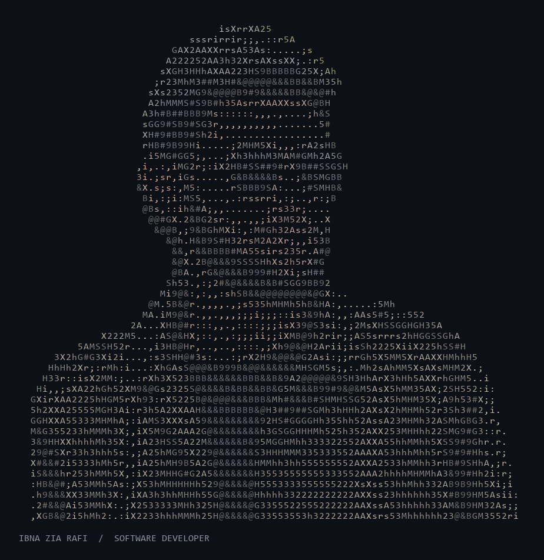

# Hey, I'm Rafi 👋

**Software developer · AI student · Builder of interactive things**

  

My photo, rendered entirely with ASCII characters. <a href="assets/ascii-avatar.txt">Plain-text version</a>

I'm **Ibna Zia Rafi**, a software developer based in **Hobart, Tasmania**. I build mobile apps, full-stack web applications and AI tools, with a growing interest in how compilers, servers and networks work underneath.

I'm completing a **Bachelor of ICT, majoring in Artificial Intelligence, at the University of Tasmania** (expected November 2026). Before that, I studied Data Telecommunication and Networking Technology at Feni Computer Institute.

[Portfolio](https://www.rafistacks.dev) · [Email](mailto:izrafi.au@gmail.com)

## What I've been building

| Project | What it does | Explore |
| --- | --- | --- |
| **Route Optimisation & Delivery Planner** | A full-stack planner with custom graph structures, Dijkstra and A* pathfinding, editable multi-stop routes, and multi-driver delivery optimisation using OR-Tools and PyVRP. Ongoing. | [Code](https://github.com/ibnaziarafi/Route-planner) · [Demo](https://routeplanner.rafistacks.dev) |
| **Olinda AI** | A collaborative college chatbot project using RAG, embeddings and pgvector, with conversation history, model fallback and a staff review dashboard. | [Code](https://github.com/ibnaziarafi/olinda-project) · [Demo](https://portal-olinda.rafistacks.dev/test_website.html) |
| **2048** | A Python game engine and React interface with keyboard and touch controls, tested move and merge logic, and a planned AI auto-play extension. | [Code](https://github.com/ibnaziarafi/2048-game) · [Demo](https://2048.rafistacks.dev) |
| **Ghorbagan** | A plant-care MVP I led with a teammate: care scheduling, AI plant identification, nearby-store availability and light measurement. | [Code](https://github.com/ibnaziarafi/Ghorbagan) |
| **The Land of Rafi** | My portfolio as an explorable 2D village, with clickable locations, changing day/night modes and optional audio. | [Code](https://github.com/ibnaziarafi/portfolio-website) · [Visit](https://www.rafistacks.dev) |

## Tools I work with

- **Languages & apps:** Python, Dart, TypeScript, Flutter, React, FastAPI
- **AI:** RAG, embeddings, vector search, TensorFlow, Gemini, Groq
- **Data:** PostgreSQL, pgvector, Supabase, Firebase, SQL, SQLite
- **Delivery:** Docker, GitHub Actions, Azure, Azure Container Registry

## A little background

- **Junior Software Programmer at TCL Informatix Ltd. (2023–2024):** one year of Flutter and Dart industry experience.
- **Founding member & lead developer at Ghorbagan (2022–2023):** helped turn a two-person plant-care project into a startup MVP.
- **Merit award, National ICT Award Bangladesh 2022:** Smart Data-Driven Plant Care.
- **3rd place, intra-college programming competition (2018):** youngest competitor.

## What I want to build next

These are **planned projects**, reflecting what I want to learn and build next.

### 01 / A compiler, from source to machine code

Build a compiler **in C/C++** for a small programming language, working through lexical analysis, parsing, semantic analysis, an intermediate representation and machine-code generation. The goal is to understand the full journey from a line of source code to an executable.

### 02 / A lightweight C/C++ web framework

Create a server-side framework inspired by **FastAPI's developer experience**, implemented in C/C++. Start with routing, request validation and a clean API, then benchmark latency, throughput and memory use. Fast execution is a design goal to measure, alongside usability.

### 03 / A local 8B coding assistant

Fine-tune an **8-billion-parameter model** around a focused job: writing useful boilerplate code for my own development workflow. Aim to run a quantised version locally on my laptop, with training and inference choices guided by the available hardware. Specialise in coding patterns rather than broad general knowledge.

### 04 / A story-driven networking & cybersecurity simulator

Build a game-like learning environment for university students, inspired by the storytelling of **Mr. Robot**. Simulated networking devices, fictional systems and guided missions would help students practise networking concepts and cybersecurity tools in an isolated learning environment.

---

**Interested in AI, developer tools or learning through games? [Let's connect.](mailto:izrafi.au@gmail.com)**
